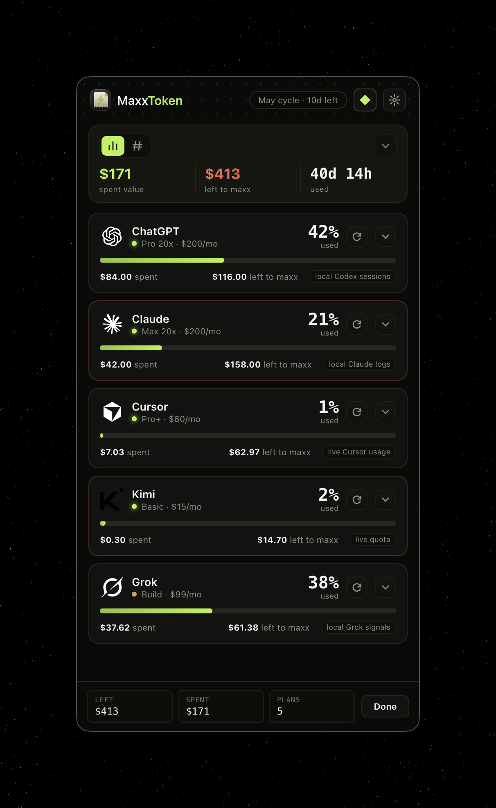

# MaxxToken

> **The reverse usage tracker.** Most apps tell you when you're using *too much*. MaxxToken tells you when you're using *too little* — so you actually spend the AI subscriptions you're already paying for.

<p align="center">
  
</p>

<p align="center">
  <a href="https://github.com/rachel-nocode/maxxtoken/releases/latest"></a>
  &nbsp;
  
  &nbsp;
  
</p>

---

## What it is

MaxxToken lives in your menu bar and watches every AI plan you pay for — Claude, ChatGPT, Cursor, Copilot, Kimi, Gemini, Grok, OpenRouter, and ~40 more. Every five-hour window, every weekly cap, every monthly cycle.

It shows you, at a glance:

- **How much of your subscription you've actually used** (and how much you're about to waste at reset).
- **Whether you're on pace, ahead, or behind** — encoded directly into the progress bar with a hairline tick, a lime underline (reserve), or a diagonal hatch (deficit).
- **Where you'll land at reset** if you keep this burn rate — with a red flag when you're projected to run out.

If you don't burn it, you lose it. MaxxToken's job is to make that loss visible.

## Install

[**Download the latest signed + notarized DMG**](https://github.com/rachel-nocode/maxxtoken/releases/latest)

Currently Apple Silicon only. Drag MaxxToken into `/Applications` and launch. The diamond icon will appear in your menu bar.

Auto-updates ship through GitHub releases — `Settings → Check for updates`.

## What makes the bar different

Most usage trackers give you a flat percentage. MaxxToken's bar packs five layers of meaning into the same canvas without adding a single extra row:

| Element                  | Visual                                  | Meaning                                                    |
| ------------------------ | --------------------------------------- | ---------------------------------------------------------- |
| **Fill**                 | solid lime, square caps                 | actual usage                                               |
| **Tick**                 | white hairline, overhangs bar ±2px      | where you *should* be at this point in the window          |
| **Reserve**              | thin lime underline below bar           | how far ahead of pace (shown only when ahead)              |
| **Deficit**              | diagonal lime hatch on bar              | how far behind pace (shown only when behind)               |
| **Burnout flag**         | red tick at right edge                  | projected to hit 100% before reset                         |

No tooltips required. The bar tells you the story.

## Features

- **Drag-to-reorder providers** in Settings. Stick the ones you actually use at the top.
- **Collapsible settings groups** — Notifications / App / Updates. Default collapsed so the provider list dominates.
- **Idea Stream** — when you have unspent capacity, MaxxToken routes a fresh app idea to the AI plan you're underusing most. Turns wasted tokens into shipped projects.
- **Maxx alerts** before resets so you know what's about to vaporize.
- **Quota warnings** when a session or weekly window is approaching empty.
- **Local-first.** Reads usage from your local CLI logs (Claude, Codex, Cursor, etc.) — no telemetry, no third party.

## Privacy & security

- **All credentials live in the macOS Keychain** via Electron's `safeStorage`. Never written to disk in plaintext.
- **No telemetry.** MaxxToken never phones home with usage data.
- **Debug log redaction.** The optional debug log (`Settings → Reveal debug log`) scrubs Bearer tokens, `sk-*` keys, JWTs, GitHub tokens, cookies, long hex secrets, and query-string credentials before any line is written.
- **App is signed with Apple Developer ID and notarized by Apple.** Verify with `spctl --assess /Applications/MaxxToken.app`.

## How it works

MaxxToken aggregates usage from:

1. **Local CLI logs** — `~/.claude`, `~/.codex`, `~/.cursor`, etc. No network call needed.
2. **Provider APIs** — for accounts where the user pastes an API key (OpenRouter, Cursor cookie, Groq, etc.).
3. **GitHub Copilot device-flow OAuth** — for Copilot subscription accounting.

The Electron main process snapshots all sources on demand and pushes the result to the menu-bar window. Snapshots run with per-provider timeouts so one hung adapter can't lock the UI.

## Build from source

Requires Node 20+, macOS, and an Apple Developer ID signing identity for distribution builds.

```bash
git clone https://github.com/rachel-nocode/maxxtoken.git
cd maxxtoken/desktop
npm install
npm start                    # dev run
npx electron-builder --mac --arm64    # signed local DMG
```

## Stack

- **Electron 42** menu-bar app (no dock icon — `LSUIElement`)
- **Vanilla JS** renderer (no framework — fast cold start)
- **macOS Keychain** via `safeStorage`
- **electron-builder** + **electron-updater** for signed, notarized, auto-updating distribution

## License

MIT — do whatever you want, just don't blame me when you finally start using your Claude Max subscription.

## Built by

[Rachel Larralde](https://rachelnocode.com) ([@rachelnocode](https://x.com/rachelnocode))
