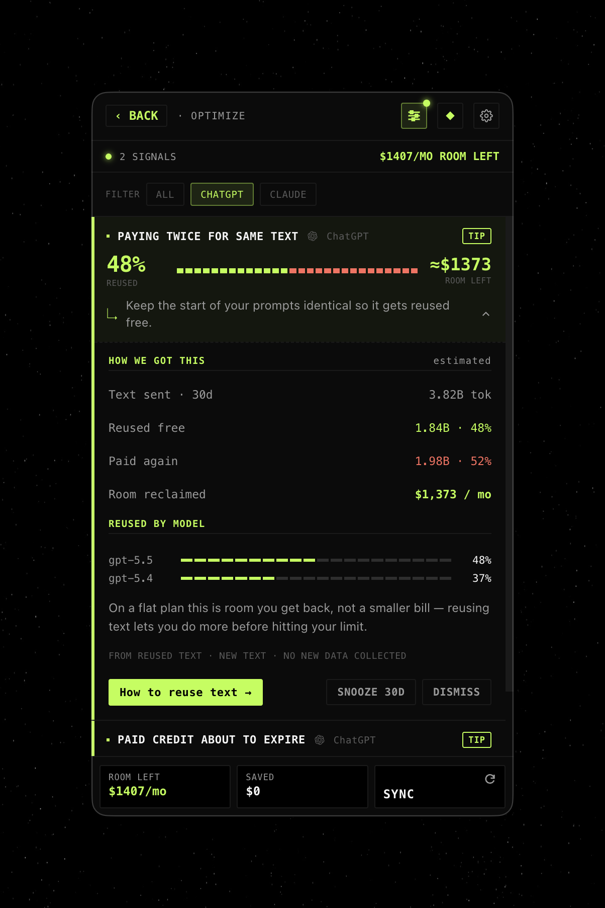

# MaxxToken

> **The reverse usage tracker.** Most apps warn when you use *too much*. MaxxToken shows when you use *too little* — so you actually spend the AI subscriptions you already pay for.

  
  &nbsp;&nbsp;
  

## What it is

MaxxToken lives in your menu bar and watches every AI plan you pay for — Claude, ChatGPT, Cursor, Copilot, Kimi, Gemini, Grok, OpenRouter, and more. Every five-hour window, every weekly cap, every monthly cycle.

At a glance it shows:

- **How much of your subscription you've actually used** — and how much you're about to waste at reset.
- **Whether you're on pace, ahead, or behind**, encoded right into the progress bar.
- **Where you'll land at reset** at your current burn rate, with a flag when you're set to run out.
- **Optimize** — spots where you pay twice for the same text and how much room you can reclaim.

If you don't burn it, you lose it. MaxxToken makes that loss visible.

## Goal

Save users tokens and help them get the most out of the AI subscriptions they already pay for.

## Availability

**Mac and Windows.** Download the latest signed build:

[**→ Get MaxxToken**](https://github.com/rachel-nocode/maxxtoken/releases/latest)

Drag into Applications and launch. Auto-updates ship through releases — `Settings → Check for updates`.

## Privacy

- **Local-first.** Reads usage from your local CLI logs — no telemetry, no third party.
- **Credentials live in the OS keychain.** Never written to disk in plaintext.
- **Signed + notarized for Mac Silicon. Windows un-signed during Beta**

## License

MIT.

## Built by

[Rachel noCode](https://rachelnocode.com) ([@rachelnocode](https://x.com/rachelnocode))
