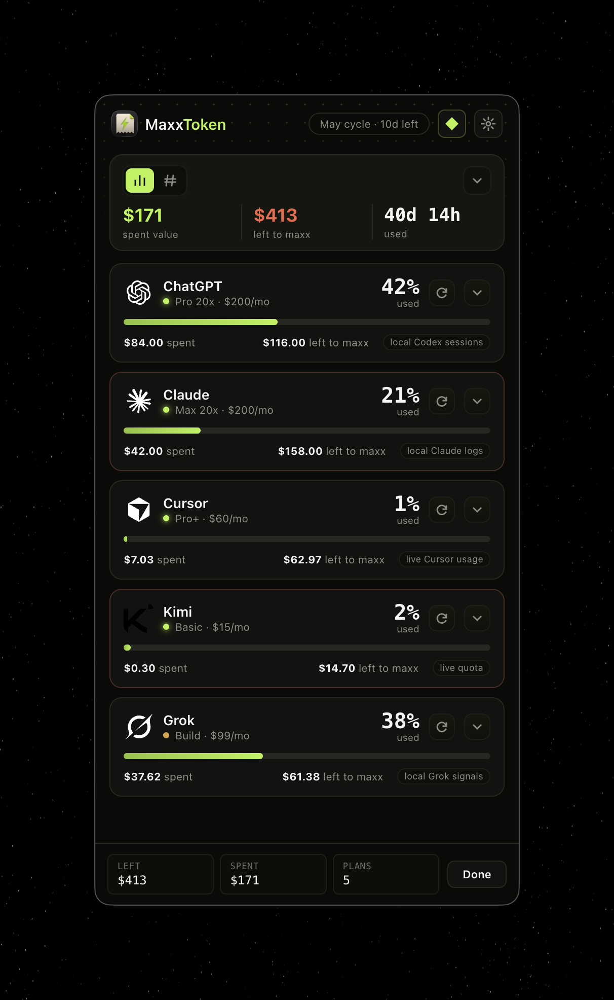
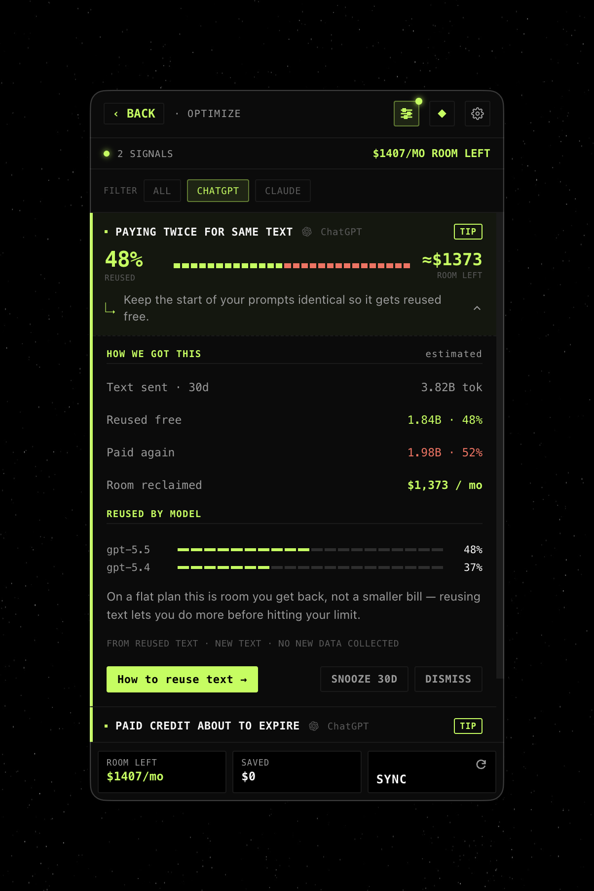

# MaxxToken

> **The reverse usage tracker.** Most apps warn when you use *too much*. MaxxToken shows when you use *too little* — so you actually spend the AI subscriptions you already pay for.

<p align="center">
  
  &nbsp;&nbsp;
  
</p>

## What it is

MaxxToken lives in your menu bar and watches every AI plan you pay for — Claude, ChatGPT, Cursor, Copilot, Kimi, Gemini, Grok, OpenRouter, and more. Every five-hour window, every weekly cap, every monthly cycle.

At a glance it shows:

- **How much of your subscription you've actually used** — and how much you're about to waste at reset.
- **Whether you're on pace, ahead, or behind**, encoded right into the progress bar.
- **Where you'll land at reset** at your current burn rate, with a flag when you're set to run out.
- **Optimize** — spots where you pay twice for the same text and how much room you can reclaim.

If you don't burn it, you lose it. MaxxToken makes that loss visible.

## Goal

Save users tokens and help them get the most out of the AI subscriptions they already pay for.

## Availability

**Mac and Windows.** Download the latest signed build:

[**→ Get MaxxToken**](https://github.com/rachel-nocode/maxxtoken/releases/latest)

Drag into Applications and launch. Auto-updates ship through releases — `Settings → Check for updates`.

## Terminal

The same bars, in your terminal — a btop-style dashboard invoked with `maxxtoken`:

```
 █▀▄▀█ ▄▀█ ▀▄▀ ▀▄▀ ▀█▀ █▀█ █▄▀ █▀▀ █▄░█
 █░▀░█ █▀█ █░█ █░█ ░█░ █▄█ █░█ ██▄ █░▀█
 Sep cycle · 18d left                                  sync 4s ago  ·  via app
╭─ TOTAL ────────────────────────────────────── Solid. Push harder on Claude. ─╮
│ ███████████████████████████░░░░░░░░░░░░░░░░░░░░░░░░░░░░░░░░░░░░░░░  41% USED │
│ SPENT $187   LEFT $273   4 plans                                             │
╰──────────────────────────────────────────────────────────────────────────────╯
╭─ ● Claude Max 20x ───────────────────────────────────────── Anthropic OAuth ─╮
│ 63% USED  $126 spent · $74.00 left                                 ⚡ 01h 23m │
│ SESSION 5H ██████████████████████████████████▌░░░░░░░   82%  resets 01h 23m  │
│ WEEKLY 7D  ██████████████████▌░░░░░░░░░░░░░░░░░░░░░░░   44%  resets 3d 04h   │
╰──────────────────────────────────────────────────────────────────────────────╯
 q quit  ·  r refresh  ·  u show left  ·  j/k scroll
```

```bash
cd desktop && npm link   # once — installs the `maxxtoken` command
maxxtoken                # live dashboard (q quits)
maxxtoken --once         # print one frame and exit (also what pipes get)
maxxtoken --json         # raw snapshot for scripts
maxxtoken --ascii --no-color
```

Data comes from the running menubar app's loopback API when it's open (so keyed providers work), otherwise the CLI reads Claude / Codex / Kimi / Gemini / Cursor directly from their local sign-ins, and falls back to the last cached snapshot. `u` flips between % used and % left, matching the app's "Usage bars" setting.

## Privacy

- **Local-first.** Reads usage from your local CLI logs — no telemetry, no third party.
- **Credentials live in the OS keychain.** Never written to disk in plaintext.
- **Signed + notarized for Mac Silicon. Windows un-signed during Beta**

## License

MIT.

## Built by

[Rachel noCode](https://rachelnocode.com) ([@rachelnocode](https://x.com/rachelnocode))
